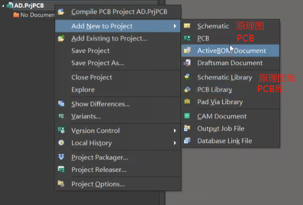
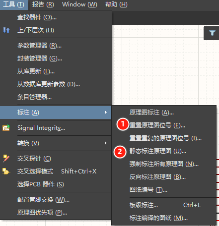

# 1. 绘制原理图

1. 文件 - 新的 - 项目 - PCB工程

2. 保存工程

3. 添加原理图文稿和PCB文稿

    

4. 原理图右下角的表头可以删除

    

5. 从库中添加元件

6. 连线

7. 添加网络编号(NET Label), 选择后按**TAB**就可以修改编号

8. **网络编号:**全部画好之后要给每个元件左上角标号

    **批量标号：**工具 - 标注 - 重置原理图位号，静态标注原理图

     

# 2.通过原理图绘制PCB

1.  **原理图封装:**首先要将原理图中的元件和PCB文件对应上

   Footprint - Add 0- 浏览 - 从PCB库中选择对应的

   * **批量处理:** 选择一个元件, 点击右键 - Find Similar Objects - Symbol Reference后面改为Same - 添加封装
   * **退出批量处理界面:**shift + c
   * **检查是否全部封装正确:**工程 - 右键 - Compile PCB Project - 右下角选中Messages即可查看是否有错误

    <figure></figure>

2. 在原理图页面点击Update Schematics in或者在PCB页面点击Import Changes From

   * 点击左下角的Validate Changes, 全部为绿色对勾代表没有问题
   * 没有问题之后点击Execute Changes

    

3. **封装管理器**: T + G

   * 在封装管理器中也可以检查所有元件是否封装完成

4. 布局

5. 布线

6. 覆铜

7. 电器规则检查(规则设置)

## 快捷键

* **连线:**CTRL + W

* **选中:** 

  * 从上向下拖: 要全部包裹

  * 从下向上拖: 碰到就可以选中

* **旋转:(鼠标左键先按住)**

  * 空格: 90度旋转
  * X : 水平翻转
  * Y : 上下翻转

* **原理图框:**

  * 变直: 放置线时按空格

   

* **文字:**

  * 放置后双击,调整文字大小颜色

   

