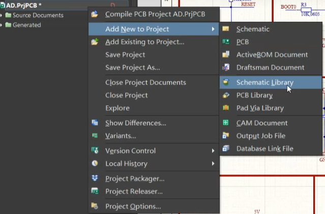
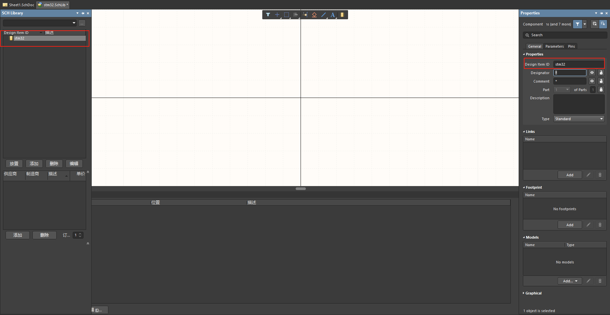
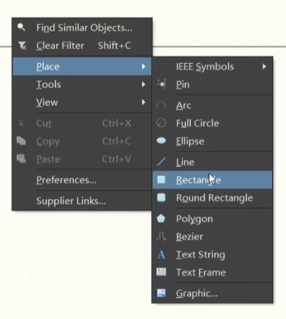
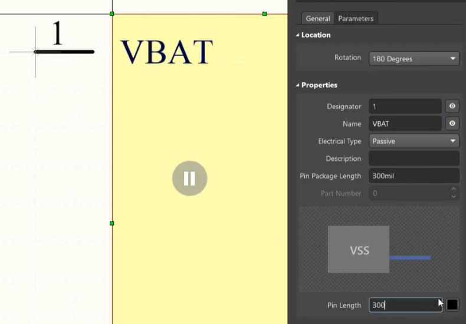
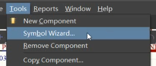
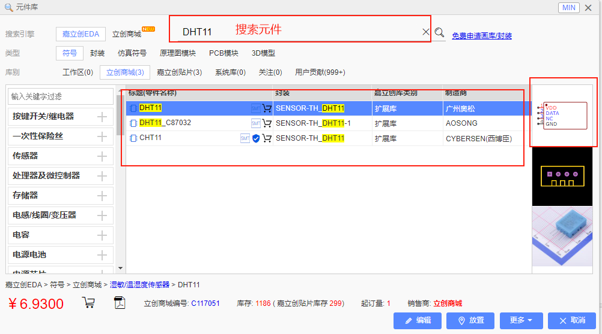

# 原理图库与封装库

## 1. 原理图库的创建和添加

1. 右键点击项目，添加原理图库文件

    

2. 保存库文件

3. 对元器件文件进行命名

4. **添加元器件**  工具 - 新原件 或者 直接点击左边的添加按钮

### 绘制元器件

#### 方法1：纯手工绘制

1. 放置形状

    

2. **放置引脚**   place - pin（放置前按Tab 对引脚信息进行编辑  编号，名称，长度）

    

3. 引脚的四个白点方向要朝外，是**连线处**

    

4. 反复上述操作即可

#### 方法2：向导

 

1. 进入向导
2. 选择引脚数，排列方式
3. **名称：**在Display Name中修改
4. **引脚属性：**在Electrical Type中修改（拖动选中可以批量修改, 改为Passive）
5. 修改完成后选择**Place Symbol**

#### 方法3：立创EDA

1. 在立创EDA中的**元件库**搜索原件

    

2. 双击右侧的原理图并导出为AltiumDesigner版本的文件

3. 在AltiumDesigner中打开

4. 点击上方菜单栏 设计 - 生成原理图库

## 2.PCB封装库的创建

1. 右键点击项目，添加PCB库文件

2. 左侧Add添加元器件

3. **放置焊盘** 点击Place Pad后按Tab编辑焊盘属性

    

   **Designator：焊盘编号**

   **Layer：焊盘层数，直插式-Multi-Layer，贴片式-Top-Layer**

   **Hole-Information（重要）：焊孔的信息 **

   ​	**Hole Size：孔大小，注意单位（mm）**

   **Size and Shape：焊盘的大小和形状**

   孔径比插针大0.1-0.2mm

   焊盘比孔径大0.45-0.5mm

   **Solder Mask Expansion：阻焊层 2mil左右**

4. 绿色为**焊孔**，灰色为**焊盘**，紫色为**阻焊层**

    

5. **丝印层（黄色）**：用于注释

   绘制丝印层之前要切换到丝印层**Top Overlay**

    

   点击放置线条，并修改线宽（10mil）

    

   复制的时候要注意按完Ctrl+C之后要用鼠标选择一个**参考点**

6. 在左侧更改元器件名称

* 按3进入3D视图，Shift + 右键进行视角拖动， 按2返回2D视图