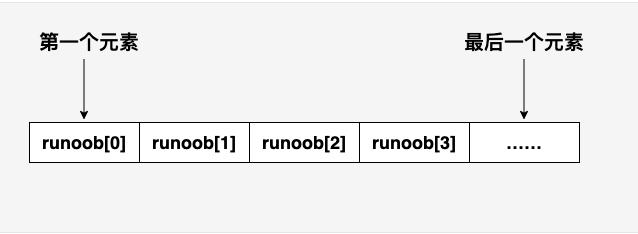
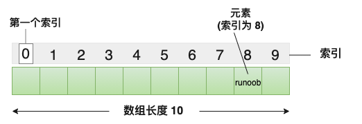
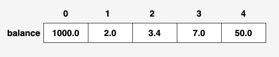
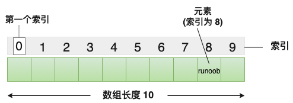

# C数组

C 语言支持**数组**数据结构，它可以存储一个固定大小的相同类型元素的顺序集合。数组是用来存储一系列数据，但它往往被认为是一系列相同类型的变量。

数组的声明并不是声明一个个单独的变量，比如 runoob0、runoob1、...、runoob99，而是声明一个数组变量，比如 runoob，然后使用 runoob[0]、runoob[1]、...、runoob[99] 来代表一个个单独的变量。

所有的数组都是由连续的内存位置组成。最低的地址对应第一个元素，最高的地址对应最后一个元素。



数组中的特定元素可以通过索引访问，第一个索引值为 0。



## 声明数组

在 C 中要声明一个数组，需要指定元素的类型和元素的数量，如下所示：

```
type arrayName [ arraySize ];
```

这叫做一维数组。**arraySize** 必须是一个大于零的整数常量，**type** 可以是任意有效的 C 数据类型。例如，要声明一个类型为 double 的包含 10 个元素的数组  **balance** ，声明语句如下：

```c
double balance[10];
```

现在 *balance* 是一个可用的数组，可以容纳 10 个类型为 double 的数字。

## 初始化数组

在 C 中，您可以逐个初始化数组，也可以使用一个初始化语句，如下所示：

```c
double balance[5] = {1000.0, 2.0, 3.4, 7.0, 50.0};
```

大括号 { } 之间的值的数目不能大于我们在数组声明时在方括号 [ ] 中指定的元素数目。

如果您省略掉了数组的大小，数组的大小则为初始化时元素的个数。因此，如果：

```c
double balance[] = {1000.0, 2.0, 3.4, 7.0, 50.0};
```

您将创建一个数组，它与前一个实例中所创建的数组是完全相同的。下面是一个为数组中某个元素赋值的实例：

```c
balance[4] = 50.0;
```

上述的语句把数组中第五个元素的值赋为 50.0。所有的数组都是以 0 作为它们第一个元素的索引，也被称为基索引，数组的最后一个索引是数组的总大小减去 1。以下是上面所讨论的数组的的图形表示：



下图是一个长度为 **10** 的数组，第一个元素的索引值为  **0** ，第九个元素 **runoob** 的索引值为  **8** :



## C 中数组详解

在 C 中，数组是非常重要的，我们需要了解更多有关数组的细节。下面列出了 C 程序员必须清楚的一些与数组相关的重要概念：


| 概念           | 描述                                                                   |
| -------------- | ---------------------------------------------------------------------- |
| 多维数组       | C 支持多维数组。多维数组最简单的形式是二维数组。                       |
| 传递数组给函数 | 您可以通过指定不带索引的数组名称来给函数传递一个指向数组的指针。       |
| 从函数返回数组 | C 允许从函数返回数组。                                                 |
| 指向数组的指针 | 您可以通过指定不带索引的数组名称来生成一个指向数组中第一个元素的指针。 |

# C **多维数组**

### 初始化二维数组

多维数组可以通过在括号内为每行指定值来进行初始化。下面是一个带有 3 行 4 列的数组。

```c
int a[3][4] = {  
 {0, 1, 2, 3} ,   /*  初始化索引号为 0 的行 */
 {4, 5, 6, 7} ,   /*  初始化索引号为 1 的行 */
 {8, 9, 10, 11}   /*  初始化索引号为 2 的行 */
};
```

内部嵌套的括号是可选的，下面的初始化与上面是等同的：

```c
int a[3][4] = {0,1,2,3,4,5,6,7,8,9,10,11};
```

# C **传递数组给函数**

如果您想要在函数中传递一个一维数组作为参数，您必须以下面三种方式来声明函数形式参数，这三种声明方式的结果是一样的，因为每种方式都会告诉编译器将要接收一个整型指针。同样地，您也可以传递一个多维数组作为形式参数。

### 方式 1

形式参数是一个指针（您可以在下一章中学习到有关指针的知识）：

```c
void myFunction(int *param)
{
.
.
.
}
```

### 方式 2

形式参数是一个已定义大小的数组：

```c
void myFunction(int param[10])
{
.
.
.
}
```

### 方式 3

形式参数是一个未定义大小的数组：

```c
void myFunction(int param[])
{
.
.
.
}
```

# C **从函数返回数组**

C 语言不允许返回一个完整的数组作为函数的参数。但是，您可以通过指定不带索引的数组名来返回一个指向数组的指针。我们将在下一章中讲解有关指针的知识，您可以先跳过本章，等了解了 C 指针的概念之后，再来学习本章的内容。

如果您想要从函数返回一个一维数组，您必须声明一个返回指针的函数，如下：

```c
int * myFunction()
{
.
.
.
}
```

另外，C 不支持在函数外返回局部变量的地址，除非定义局部变量为 **static** 变量。

现在，让我们来看下面的函数，它会生成 10 个随机数，并使用数组来返回它们，具体如下：

```c
#include <stdio.h>
#include <stdlib.h>
#include <time.h>
 
/* 要生成和返回随机数的函数 */
int * getRandom( )
{
  static int  r[10];
  int i;
 
  /* 设置种子 */
  srand( (unsigned)time( NULL ) );
  for ( i = 0; i < 10; ++i)
  {
     r[i] = rand();
     printf( "r[%d] = %d\n", i, r[i]);
 
  }
 
  return r;
}
 
/* 要调用上面定义函数的主函数 */
int main ()
{
   /* 一个指向整数的指针 */
   int *p;
   int i;
 
   p = getRandom();
   for ( i = 0; i < 10; i++ )
   {
       printf( "*(p + %d) : %d\n", i, *(p + i));
   }
 
   return 0;
}
```

当上面的代码被编译和执行时，它会产生下列结果：

```
r[0] = 313959809
r[1] = 1759055877
r[2] = 1113101911
r[3] = 2133832223
r[4] = 2073354073
r[5] = 167288147
r[6] = 1827471542
r[7] = 834791014
r[8] = 1901409888
r[9] = 1990469526
*(p + 0) : 313959809
*(p + 1) : 1759055877
*(p + 2) : 1113101911
*(p + 3) : 2133832223
*(p + 4) : 2073354073
*(p + 5) : 167288147
*(p + 6) : 1827471542
*(p + 7) : 834791014
*(p + 8) : 1901409888
*(p + 9) : 1990469526
```

# C **指向数组的指针**

您可以先跳过本章，等了解了 C 指针的概念之后，再来学习本章的内容。

如果您对 C 语言中指针的概念有所了解，那么就可以开始本章的学习。数组名是一个指向数组中第一个元素的常量指针。因此，在下面的声明中：

```c
double balance[50];
```

**balance** 是一个指向 &balance[0] 的指针，即数组 balance 的第一个元素的地址。因此，下面的程序片段把 **p** 赋值为 **balance** 的第一个元素的地址：

```c
double *p;
double balance[10];

p = balance;
```

使用数组名作为常量指针是合法的，反之亦然。因此，*(balance + 4) 是一种访问 balance[4] 数据的合法方式。

一旦您把第一个元素的地址存储在 p 中，您就可以使用 *p、*(p+1)、*(p+2) 等来访问数组元素。下面的实例演示了上面讨论到的这些概念：

```c
#include <stdio.h>
 
int main ()
{
   /* 带有 5 个元素的整型数组 */
   double balance[5] = {1000.0, 2.0, 3.4, 17.0, 50.0};
   double *p;
   int i;
 
   p = balance;
 
   /* 输出数组中每个元素的值 */
   printf( "使用指针的数组值\n");
   for ( i = 0; i < 5; i++ )
   {
       printf("*(p + %d) : %f\n",  i, *(p + i) );
   }
 
   printf( "使用 balance 作为地址的数组值\n");
   for ( i = 0; i < 5; i++ )
   {
       printf("*(balance + %d) : %f\n",  i, *(balance + i) );
   }
 
   return 0;
}
```

当上面的代码被编译和执行时，它会产生下列结果：

```
使用指针的数组值
*(p + 0) : 1000.000000
*(p + 1) : 2.000000
*(p + 2) : 3.400000
*(p + 3) : 17.000000
*(p + 4) : 50.000000
使用 balance 作为地址的数组值
*(balance + 0) : 1000.000000
*(balance + 1) : 2.000000
*(balance + 2) : 3.400000
*(balance + 3) : 17.000000
*(balance + 4) : 50.000000
```

在上面的实例中，p 是一个指向 double 型的指针，这意味着它可以存储一个 double 类型的变量。一旦我们有了 p 中的地址，***p** 将给出存储在 p 中相应地址的值，正如上面实例中所演示的。
