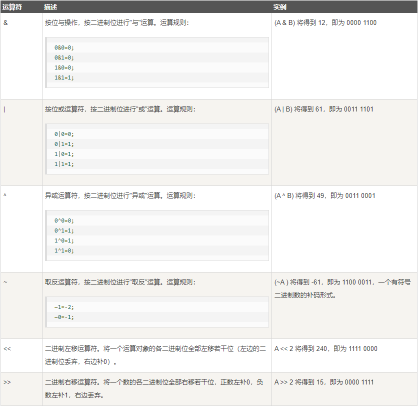

# C运算符

运算符是一种告诉编译器执行特定的数学或逻辑操作的符号。C 语言内置了丰富的运算符，并提供了以下类型的运算符：

* 算术运算符
* 关系运算符
* 逻辑运算符
* 位运算符
* 赋值运算符
* 杂项运算符

## 算术运算符

下表显示了 C 语言支持的所有算术运算符。假设变量 **A** 的值为 10，变量 **B** 的值为 20，则：


| 运算符 | 描述                             | 实例             |
| ------ | -------------------------------- | ---------------- |
| +      | 把两个操作数相加                 | A + B 将得到 30  |
| -      | 从第一个操作数中减去第二个操作数 | A - B 将得到 -10 |
| *      | 把两个操作数相乘                 | A * B 将得到 200 |
| /      | 分子除以分母                     | B / A 将得到 2   |
| %      | 取模运算符，整除后的余数         | B % A 将得到 0   |
| ++     | 自增运算符，整数值增加 1         | A++ 将得到 11    |
| --     | 自减运算符，整数值减少 1         | A-- 将得到 9     |

以下实例演示了 a++ 与 ++a 的区别：

```c
#include <stdio.h>
 
int main()
{
   int c;
   int a = 10;
   c = a++; 
   printf("先赋值后运算：\n");
   printf("Line 1 - c 的值是 %d\n", c );
   printf("Line 2 - a 的值是 %d\n", a );
   a = 10;
   c = a--; 
   printf("Line 3 - c 的值是 %d\n", c );
   printf("Line 4 - a 的值是 %d\n", a );
 
   printf("先运算后赋值：\n");
   a = 10;
   c = ++a; 
   printf("Line 5 - c 的值是 %d\n", c );
   printf("Line 6 - a 的值是 %d\n", a );
   a = 10;
   c = --a; 
   printf("Line 7 - c 的值是 %d\n", c );
   printf("Line 8 - a 的值是 %d\n", a );
 
}
```

以上程序执行输出结果为：

```c
先赋值后运算：
Line 1 - c 的值是 10
Line 2 - a 的值是 11
Line 3 - c 的值是 10
Line 4 - a 的值是 9
先运算后赋值：
Line 5 - c 的值是 11
Line 6 - a 的值是 11
Line 7 - c 的值是 9
Line 8 - a 的值是 9
```

## 关系运算符

下表显示了 C 语言支持的所有关系运算符。假设变量 **A** 的值为 10，变量 **B** 的值为 20，则：


| 运算符 | 描述                                                           | 实例              |
| ------ | -------------------------------------------------------------- | ----------------- |
| =\=    | 检查两个操作数的值是否相等，如果相等则条件为真。               | (A =\= B) 为假。  |
| !\=    | 检查两个操作数的值是否相等，如果不相等则条件为真。             | (A !\= B) 为真。 |
| >      | 检查左操作数的值是否大于右操作数的值，如果是则条件为真。       | (A > B) 为假。    |
| <      | 检查左操作数的值是否小于右操作数的值，如果是则条件为真。       | (A < B) 为真。    |
| >\=    | 检查左操作数的值是否大于或等于右操作数的值，如果是则条件为真。 | (A >\= B) 为假。  |
| <\=    | 检查左操作数的值是否小于或等于右操作数的值，如果是则条件为真。 | (A <\= B) 为真。  |

## 逻辑运算符

下表显示了 C 语言支持的所有关系逻辑运算符。假设变量 **A** 的值为 1，变量 **B** 的值为 0，则：


| 运算符 | 描述                                                                               | 实例             |
| ------ | ---------------------------------------------------------------------------------- | ---------------- |
| &&     | 称为逻辑与运算符。如果两个操作数都非零，则条件为真。                               | (A && B) 为假。  |
| \|\|   | 称为逻辑或运算符。如果两个操作数中有任意一个非零，则条件为真                       | (A\|\|B)为真。   |
| !      | 称为逻辑非运算符。用来逆转操作数的逻辑状态。如果条件为真则逻辑非运算符将使其为假。 | !(A && B) 为真。 |

## 位运算符

位运算符作用于位，并逐位执行操作。&、 | 和 ^ 的真值表如下所示：


| p | q | p & q | p\| q | p ^ q |
| - | - | ----- | ------ | ----- |
| 0 | 0 | 0     | 0      | 0     |
| 0 | 1 | 0     | 1      | 1     |
| 1 | 1 | 1     | 1      | 0     |
| 1 | 0 | 0     | 1      | 1     |

假设如果 A = 60，且 B = 13，现在以二进制格式表示，它们如下所示：

A = 0011 1100

B = 0000 1101

---

A&B = 0000 1100

A|B = 0011 1101

A^B = 0011 0001

~A  = 1100 0011

下表显示了 C 语言支持的位运算符。假设变量 **A** 的值为 60，变量 **B** 的值为 13，则：



### 实例

请看下面的实例，了解 C 语言中所有可用的位运算符：

```c
#include <stdio.h>
 
int main()
{
 
   unsigned int a = 60;    /* 60 = 0011 1100 */  
   unsigned int b = 13;    /* 13 = 0000 1101 */
   int c = 0;         
 
   c = a & b;       /* 12 = 0000 1100 */ 
   printf("Line 1 - c 的值是 %d\n", c );
 
   c = a | b;       /* 61 = 0011 1101 */
   printf("Line 2 - c 的值是 %d\n", c );
 
   c = a ^ b;       /* 49 = 0011 0001 */
   printf("Line 3 - c 的值是 %d\n", c );
 
   c = ~a;          /*-61 = 1100 0011 */
   printf("Line 4 - c 的值是 %d\n", c );
 
   c = a << 2;     /* 240 = 1111 0000 */
   printf("Line 5 - c 的值是 %d\n", c );
 
   c = a >> 2;     /* 15 = 0000 1111 */
   printf("Line 6 - c 的值是 %d\n", c );
}
```

当上面的代码被编译和执行时，它会产生下列结果：

```
Line 1 - c 的值是 12
Line 2 - c 的值是 61
Line 3 - c 的值是 49
Line 4 - c 的值是 -61
Line 5 - c 的值是 240
Line 6 - c 的值是 15
```

## 赋值运算符

下表列出了 C 语言支持的赋值运算符：


| 运算符 | 描述                                                             | 实例                            |
| ------ | ---------------------------------------------------------------- | ------------------------------- |
| =      | 简单的赋值运算符，把右边操作数的值赋给左边操作数                 | C = A + B 将把 A + B 的值赋给 C |
| +=     | 加且赋值运算符，把右边操作数加上左边操作数的结果赋值给左边操作数 | C += A 相当于 C = C + A         |
| -=     | 减且赋值运算符，把左边操作数减去右边操作数的结果赋值给左边操作数 | C -= A 相当于 C = C - A         |
| *=     | 乘且赋值运算符，把右边操作数乘以左边操作数的结果赋值给左边操作数 | C *= A 相当于 C = C * A         |
| /\=    | 除且赋值运算符，把左边操作数除以右边操作数的结果赋值给左边操作数 | C /\= A 相当于 C = C / A        |
| %=     | 求模且赋值运算符，求两个操作数的模赋值给左边操作数               | C %= A 相当于 C = C % A         |
| <\<\=  | 左移且赋值运算符                                                 | C <<\= 2 等同于 C = C << 2      |
| >>\=   | 右移且赋值运算符                                                 | C >>\= 2 等同于 C = C >> 2      |
| &\=    | 按位与且赋值运算符                                               | C &\= 2 等同于 C = C & 2        |
| ^\=    | 按位异或且赋值运算符                                             | C ^\= 2 等同于 C = C ^ 2        |
| \|\=   | 按位或且赋值运算符                                               | C\|\= 2 等同于 C = C \| 2    |

## 杂项运算符 ↦ sizeof & 三元

下表列出了 C 语言支持的其他一些重要的运算符，包括 **sizeof** 和  **? :** 。


| 运算符   | 描述             | 实例                                 |
| -------- | ---------------- | ------------------------------------ |
| sizeof() | 返回变量的大小。 | sizeof(a) 将返回 4，其中 a 是整数。  |
| &        | 返回变量的地址。 | &a; 将给出变量的实际地址。           |
| *        | 指向一个变量。   | *a; 将指向一个变量。                 |
| ? :      | 条件表达式       | 如果条件为真 ? 则值为 X : 否则值为 Y |

### 实例

请看下面的实例，了解 C 语言中所有可用的杂项运算符：

```c
#include <stdio.h>
 
int main()
{
   int a = 4;
   short b;
   double c;
   int* ptr;
 
   /* sizeof 运算符实例 */
   printf("Line 1 - 变量 a 的大小 = %lu\n", sizeof(a) );
   printf("Line 2 - 变量 b 的大小 = %lu\n", sizeof(b) );
   printf("Line 3 - 变量 c 的大小 = %lu\n", sizeof(c) );
 
   /* & 和 * 运算符实例 */
   ptr = &a;    /* 'ptr' 现在包含 'a' 的地址 */
   printf("a 的值是 %d\n", a);
   printf("*ptr 是 %d\n", *ptr);
 
   /* 三元运算符实例 */
   a = 10;
   b = (a == 1) ? 20: 30;
   printf( "b 的值是 %d\n", b );
 
   b = (a == 10) ? 20: 30;
   printf( "b 的值是 %d\n", b );
}
```

当上面的代码被编译和执行时，它会产生下列结果：

```
Line 1 - 变量 a 的大小 = 4
Line 2 - 变量 b 的大小 = 2
Line 3 - 变量 c 的大小 = 8
a 的值是 4
*ptr 是 4
b 的值是 30
b 的值是 20
```

## C 中的运算符优先级

运算符的优先级确定表达式中项的组合。这会影响到一个表达式如何计算。某些运算符比其他运算符有更高的优先级，例如，乘除运算符具有比加减运算符更高的优先级。

例如 x = 7 + 3 * 2，在这里，x 被赋值为 13，而不是 20，因为运算符 * 具有比 + 更高的优先级，所以首先计算乘法 3*2，然后再加上 7。

下表将按运算符优先级从高到低列出各个运算符，具有较高优先级的运算符出现在表格的上面，具有较低优先级的运算符出现在表格的下面。在表达式中，较高优先级的运算符会优先被计算。


| 类别       | 运算符                                    | 结合性   |
| ---------- | ----------------------------------------- | -------- |
| 后缀       | () [] -\> . ++ --                         | 从左到右 |
| 一元       | + - ! ~ ++ - - (type)* & sizeof           | 从右到左 |
| 乘除       | * / %                                     | 从左到右 |
| 加减       | + -                                       | 从左到右 |
| 移位       | << >>                                     | 从左到右 |
| 关系       | < <\= > >\=                               | 从左到右 |
| 相等       | =\= !\=                                   | 从左到右 |
| 位与 AND   | &                                         | 从左到右 |
| 位异或 XOR | ^                                         | 从左到右 |
| 位或 OR    | \|                                        | 从左到右 |
| 逻辑与 AND | &&                                        | 从左到右 |
| 逻辑或 OR  | \|\|                                      | 从左到右 |
| 条件       | ?:                                        | 从右到左 |
| 赋值       | = += -= *= /\= %= \>>\= <\<\= &= ^= \|\= | 从右到左 |
| 逗号       | ,                                         | 从左到右 |
