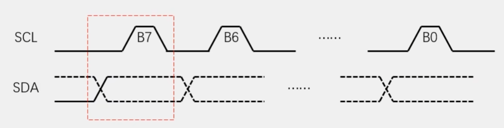
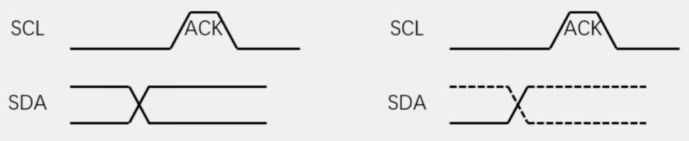

# I2C通信（Inter IC Bus）

## 总览

* **两根通信线：** 
  * SCL（Serial Clock）串行时钟线
  * SDA（Serial Data）串行数据线
* **同步、半双工**
* **带数据应答**
* **支持总线挂载多个设备**
  * 一主多从：单片机作为主机主导I2C总线的运行，挂载在I2C总线上的都是从机，从机只有在**被主机点名后才可以控制总线**，防止冲突
  * 多主多从：可以有多个主设备，但为了避免冲突，I2C协议会进行仲裁

## 硬件电路（开漏 + 弱上拉）

* 所有设备的**SCL，SDA连接在一起**
* 设备的SCL和SDA均要配置成**开漏输出**模式**(开漏)**
* SCL和SDA各添加一个**上拉电阻**，阻值一般为**4.7KΩ**左右**（弱上拉）**
  * 完全**杜绝了电源短路**现象，保证电路安全（因为所有设备只能输出低电平或不输出，不会有输出高电平的情况）
  * 避免了引脚**模式的频繁**切换

## 软件规定

### 1. 时序基本单元

* **起始条件：**SCL高电平期间，SDA从**高**电平切换到**低**电平
* **终止条件：**SCL高电平期间，SDA从**低**电平切换到**高**电平

 

* **发送一个字节**：
  * SCL低电平期间，**主机**将数据位依次**写入**到SDA线上（**高位先行**，串口通讯是低位先行）
  * 然后释放SCL，**从机**在SCL高电平期间**读取**数据位
    * SCL高电平期间SDA不允许有数据变化，依次循环8次，即可发送一个字节

* **接收一个字节**：
  * SCL低电平期间，**从机**将数据位依次**写入**到SDA线上（**高位先行**，串口通讯是低位先行）
  * 然后释放SCL，**主机**在SCL高电平期间**读取**数据位
    * SCL高电平期间SDA不允许有数据变化，依次循环8次，即可发送一个字节
    * 主机在接收之前要释放SDA
* **默认状态**下SDA都处于释放状态（**高电平**），也就是主从机都处在**接收模式**，也只有主机能控制SDA状态，要发送的时候拉低SDA（低电平）

* **发送应答**：
  * 主机在接收完一个字节后，在下一个时钟**发送一位数据**，0表示应答，1表示非应答
* **接收应答**：
  * 主机在发送完一个字节后，在下一个时钟**接收一位数据**，0表示应答，1表示非应答（主机在接收前要释放SDA）

 

## 2. 完整时序

### 从机地址

每个设备都有一个**唯一的设备地址**，主机在起始条件后要**发送一个字节寻找从机**，所有从机收到后都会**和自己的设备地址比较**，并确定是否参与后续时序

在同一条I2C总线中，挂载的**每一个设备地址必须不一样**，从机设备地址分为7位地址和10位地址，**7位地址**应用范围最广

每一个I2C设备**出厂时都会被分配**一个7位地址，一般**不同型号的芯片地址都不同**

一般地址的最**后几位都是可变地址**，防止相同型号芯片挂载在同一总线

* **指定地址写：**
  * 通过**从机地址（Slave Address）**来确定，在指定地址**（Reg Address寄存器地址）**下，写入指定数据
  * **从机地址：1101 000    指定地址：0001 1001    指定数据：1010 1010    RA（应答）  R/W（读1或写0）**

* **当前地址读：**
  * 对于**指定设备（Slave Address）**，在**当前地址指针指示的地址**下，读取从机数据
    * **当前地址指针：**从机的寄存器中默认有一个**地址指针指向0地址**，进行**一次写或读操作后**，指针会**自增**
    * 当主机读取时**没有指定寄存器地址**，就默认返回**该地址指针指向的寄存器值**

 

* **指定地址读：**
  * 对于**指定设备（Slave Address）**，在**指定地址（Reg Address）**下，读取从机数据
  * 进行指定地址写的**指定从机地址**和**指定寄存器地址**部分后，进行**Sr（Start repeat）**，再进行**当前地址读**                                          

* **停止读取：**
  * 读取完成之后要给从机发送一个**非应答（Send ACK，SA）**，也就是主机应答时不把SDA拉低
  * 从机读到SDA为1（代表主机没有应答），从机就会释放总线，把SDA的控制权交还给主机
    * 也就是说，主机发送应答（RA），从机继续发送数据，主机发送非应答（SA），从机停止发送数据，并释放SDA