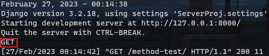

# 利用Django搭建一个个人网站

## 1.MVC模型

MVC 模式（Model–view–controller）是软件工程中的一种软件架构模式，把软件系统分为三个基本部分：模型（Model）、视图（View）和控制器（Controller）。

MVC 以一种插件式的、松耦合的方式连接在一起。

- 模型（M）- 编写程序应有的功能，负责业务对象与数据库的映射(ORM)。
- 视图（V）- 图形界面，负责与用户的交互(页面)。
- 控制器（C）- 负责转发请求，对请求进行处理。

**简易图：**

 

**用户操作流程图：**

 

## 2.创建虚拟环境

使用Python本身自带的 [venv](https://docs.python.org/3/tutorial/venv.html) 来管理环境。

要为项目创建一个虚拟环境，打开新的命令行窗口，转至想创建项目的文件夹，然后输入如下命令

```
...\> py -m venv project-name
```

This will create a folder called 'project-name' if it does not already exist and set up the virtual environment. 

To activate the environment, run:

```
...\> project-name\Scripts\activate.bat
```

虚拟环境就会激活，并且会在命令提示符旁边看到 "(project-name)" 指向该环境。

### **每次打开新的命令行窗口，需要再次激活环境。**

## 3.安装Django

在命令提示行中，确认虚拟环境是激活的，然后运行以下命令:

```
...\> py -m pip install Django
```

这将下载并安装最新的 Django 发布版本。

安装完成后，可以在命令提示符运行 `django-admin --version` 验证安装的 Django。

## 4.创建项目

使用 django-admin 来创建 HelloWorld 项目：

```
django-admin startproject HelloWorld
```

创建完成后我们可以查看下项目的目录结构：

```
$ cd HelloWorld/
$ tree (/F in Windows)
.
|-- HelloWorld
|   |-- __init__.py
|   |-- asgi.py
|   |-- settings.py
|   |-- urls.py
|   `-- wsgi.py
`-- manage.py
```

目录说明：

- **HelloWorld:** 项目的容器。
- **manage.py:** 一个实用的命令行工具，可让你以各种方式与该 Django 项目进行交互。
- **HelloWorld/__init__.py:** 一个空文件，告诉 Python 该目录是一个 Python 包。
- **HelloWorld/asgi.py:** 一个 ASGI 兼容的 Web 服务器的入口，以便运行你的项目。
- **HelloWorld/settings.py:** 该 Django 项目的设置/配置。
- **HelloWorld/urls.py:** 该 Django 项目的 URL 声明; 一份由 Django 驱动的网站"目录"。
- **HelloWorld/wsgi.py:** 一个 WSGI 兼容的 Web 服务器的入口，以便运行你的项目。

接下来我们进入 HelloWorld 目录输入以下命令，

### 启动服务器：

```
python3 manage.py runserver 0.0.0.0:8000
```

0.0.0.0 让其它电脑可连接到开发服务器，8000 为端口号。如果不说明，那么端口号默认为 8000。

在浏览器输入你服务器的 ip（这里我们输入本机 IP 地址： **127.0.0.1:8000**） 及端口号，如果正常启动，输出结果如下：

 

## 5.视图和 URL 配置

在先前创建的 HelloWorld 目录下的 HelloWorld 目录新建一个 views.py 文件，并输入代码：

```
HelloWorld/HelloWorld/views.py 文件代码：

from django.http import HttpResponse
 
def hello(request):
    return HttpResponse("Hello world ! ")
```

接着，绑定 URL 与视图函数。打开 urls.py 文件，删除原来代码，将以下代码复制粘贴到 urls.py 文件中：

```
HelloWorld/HelloWorld/urls.py 文件代码：

from django.conf.urls import url
 
from . import views
 
urlpatterns = [
    url(r'^$', views.hello),
]
```

整个目录结构如下：

```
$ tree
.
|-- HelloWorld
|   |-- __init__.py
|   |-- __init__.pyc
|   |-- settings.py
|   |-- settings.pyc
|   |-- urls.py              # url 配置
|   |-- urls.pyc
|   |-- views.py              # 添加的视图文件
|   |-- views.pyc             # 编译后的视图文件
|   |-- wsgi.py
|   `-- wsgi.pyc
`-- manage.py
```

完成后，启动 Django 开发服务器，并在浏览器访问打开浏览器并访问：

 

我们也可以修改以下规则：

```
HelloWorld/HelloWorld/urls.py 文件代码：

from django.urls import path//变化
 
from . import views
 
urlpatterns = [
    path('hello/', views.hello),//变化
]
```

通过浏览器打开 **http://127.0.0.1:8000/hello**，输出结果如下：

**注意：**项目中如果代码有改动，服务器会**自动监测代码的改动并自动重新载入**，所以如果你已经启动了服务器则**不需手动重启**。

### path()函数

Django path() 可以接收四个参数，分别是两个**必选参数：route、view** 和两个**可选参数：kwargs、name**。

语法格式：

```
path(route, view, kwargs=None, name=None)
```

- **route:** 字符串，表示 URL 规则，与之匹配的 URL 会执行对应的第二个参数 view。
- **view:** 用于执行与正则表达式匹配的 URL 请求。
- **kwargs:** 视图使用的字典类型的参数。
- **name:** 用来反向获取 URL。

Django2. 0中可以使用 **re_path()** 方法来兼容 1.x 版本中的 **url()** 方法，

### 一些正则表达式的规则也可以通过 re_path() 来实现 。

```
from django.urls import include, re_path

urlpatterns = [
    re_path(r'^index/$', views.index, name='index'),
    re_path(r'^bio/(?P<username>\w+)/$', views.bio, name='bio'),
    re_path(r'^weblog/', include('blog.urls')),
    ...
]
```

## 6.Django模板

上面使用到django.http.HttpResponse() 来输出 "Hello World！"。该方式将数据与视图混合在一起，**不符合 Django 的 MVC 思想**。

模板是一个**文本**，用于**分离文档的表现形式和内容**。

### 模板应用实例

在 ServerProj 目录底下**创建 templates 目录**并建立 test1.html文件，整个目录结构如下：

```
D:.
│  db.sqlite3
│  manage.py
│
├─ServerProj
│  │  asgi.py
│  │  settings.py
│  │  urls.py
│  │  views.py
│  │  wsgi.py
│  │  __init__.py
│  │
│  └─__pycache__
│          settings.cpython-36.pyc
│          urls.cpython-36.pyc
│          views.cpython-36.pyc
│          wsgi.cpython-36.pyc
│          __init__.cpython-36.pyc
│
└─templates
        test1.html
```

```html
#test1.html 文件代码如下：

<h1>
    {{ hello }} #变量
</h1>
```

从模板中我们知道**变量使用了双括号**。

接下来我们需要向Django说明模板文件的路径，修改ServerProj/settings.py，修改 TEMPLATES 中的 DIRS 为 **[os.path.join(BASE_DIR, 'templates')]**，如下所示:

```python
#顶部导入os包
from pathlib import Path
import os					#修改位置

TEMPLATES = [
    {
        'BACKEND': 'django.template.backends.django.DjangoTemplates',
        'DIRS': [os.path.join(BASE_DIR, 'templates')], 			#修改位置
        'APP_DIRS': True,
        'OPTIONS': {
            'context_processors': [
                'django.template.context_processors.debug',
                'django.template.context_processors.request',
                'django.contrib.auth.context_processors.auth',
                'django.contrib.messages.context_processors.messages',
            ],
        },
    },
]
```

现在修改 views.py，增加一个新的对象，用于向模板提交数据：

```python
#views.py
from django.http import HttpResponse
from django.shortcuts import render #添加引用

def homepage(request):
    return HttpResponse("<h1>Hello, homepage!</h1>")

def hello(request):					#新增对象
    context = {}
    context['hello'] = 'Hello World!'
    return render(request, 'test1.html', context)
```

```python
#urls.py
from django.urls import path
from . import views

urlpatterns = [
    path('', views.homepage),
    path('test1/', views.hello)		#新增
]
```

可以看到，这里使**用 render 来替代之前使用的 HttpResponse**。render 还**使用了一个字典 context 作为参数**。

context 字典中元素的键值 **hello** 对应了模板中的变量 **{{ hello }}**。

再次访问 **http://127.0.0.1:8000/test1**，可以看到页面：

 

这样就完成了**使用模板来输出数据**，从而实现**数据与视图分离**。

### Django模板标签（语法）

#### 1.变量

模板语法：

```
view：｛"HTML变量名" : "views变量名"｝
HTML：｛｛变量名｝｝
```

```python
#views.py 文件代码
from django.shortcuts import render

def runoob(request):
  views_name = "变量测试" 		#html变量中要显示的内容
  return  render(request,"runoob.html", {"name":views_name})
```

```html
# templates 中的 variable_test.html ：
<p>{{ name }}</p>
```

 

访问 http://127.0.0.1:8000/var_test，可以看到页面：

 

#### 2.列表

templates 中的 html文件中，可以用 **.** 索引下标取出对应的元素。

```python
#views.py 文件代码
from django.shortcuts import render

#列表
def listTest(request):
    views_list = ["列表元素1", "列表元素2", "列表元素3"]
    return render(request, "list_test.html", {"views_list" : views_list}) #{"html变量名" : views变量名}
```

```html
# templates 中的 list_test.html ：
<h1>
    <!-- 取出整个列表 -->
    {{ views_list }}
</h1>
<p>
    <!-- 取出列表中的第一个元素 -->
    {{ views_list.0 }} 
</p>
```

访问 http://127.0.0.1:8000/list_test，可以看到页面：

 

#### 3.字典

templates 中的 dict_test.html中，可以用 **.键** 取出对应的值。

```python
#views.py 文件代码
from django.shortcuts import render

#字典
def dictTest(request):
    views_dict = {"name":"cy","age":"24"}
    return render(request, "dict_test.html", {"views_dic" : views_dict})
```

```html
# templates 中的 dict_test.html ：
<h1>
    <!-- 取出整个字典 -->
    {{ views_dic }}
</h1>
<p>
    <!-- 取出字典元素 -->
   	{{ views_dic.age }}
</p>
```

访问 http://127.0.0.1:8000/dict_test，可以看到页面：

 

#### 4.过滤器

##### 模板语法：

```
{{ 变量名 | 过滤器：可选参数 }}
```

模板过滤器可以在变量被显示前修改它，过滤器使用管道字符，如下所示：

```
{{ name|lower }}
```

{{ name }} 变量被过滤器 lower 处理后，文档大写转换文本为小写。

过滤管道可以被 **套接** ，既是说，**一个过滤器管道的输出又可以作为下一个管道的输入**：

```
{{ my_list|first|upper }}
```

以上实例将第一个元素取出并将其转化为大写。

有些过滤器有**参数**。 过滤器的参数**跟随冒号之后**并且**总是以双引号包含**。 例如：truncatewords

```
{{ bio|truncatewords:"30" }}
```

这个将显示变量 bio 的前30个词。

**其他过滤器：**

##### addslashes

​	添加反斜杠到任何反斜杠、单引号或者双引号前面。

##### default

default 为变量提供一个默认值。

如果 views 传的变量的布尔值是 false，则使用指定的默认值。

以下值为 false：

```
0  0.0  False  0j  ""  []  ()  set()  {}  None
```

```python
#views.py 文件代码
from django.shortcuts import render

#过滤器:default
def defTest(request):
    name = 0
    return render(request, "def_test.html", {"name" : name})
```

```html
# templates 中的 default_test.html ：
<h1>
    <!-- 取出name字段,如果为false,则默认为"用户名" -->
    {{ name | default:"用户名" }}
</h1>
```

访问 http://127.0.0.1:8000/def_test，可以看到页面：

 

##### length

返回对象的长度，适用于字符串和列表，字符串返回的是字符串长度，列表返回的是元素个数。

字典返回的是键值对的数量，集合返回的是去重后的长度。

```python
#views.py 文件代码
from django.shortcuts import render

# 过滤器:length
def lengthtest(request):
    views_list = ['red', 'green', 'blue', 'yellow', 'white', 'black']
    return render(request, "length_test.html", {"list" : views_list})
```

```html
# templates 中的 length_test.html ：
<h1>
    <!-- 显示list字段的长度 -->
    {{ list | length }}
</h1>
```

访问 http://127.0.0.1:8000/length_test，可以看到页面：

 

##### filesizeformat

以更易读的方式显示文件的大小（即'13 KB', '4.1 MB', '102 bytes'等）。

字典返回的是键值对的数量，集合返回的是去重后的长度。

```python
#views.py 文件代码
from django.shortcuts import render

# 过滤器:filesizeformat
def fSizeFmttest(request):
    size = 2048
    return render(request, "fsizeFmt_test.html", {"size" : size})
```

```html
# templates 中的 fsizeFmt_test.html ：
<h1>
    <!-- 把文件大小格式化输出 -->
    {{ size | filesizeformat }}
</h1>
```

访问 http://127.0.0.1:8000/fsf_test，可以看到页面：

 

##### date

根据给定格式对一个日期变量进行格式化。

格式 **Y-m-d H:i:s**返回 **年-月-日 小时:分钟:秒** 的格式时间。

```python
#views.py 文件代码
from django.shortcuts import render

# 过滤器:date
def datetest(request):
    import datetime
    time = datetime.datetime.now()
    return render(request, "date_test.html", {"time" : time})
```

```html
<!-- 过滤器和参数之间不能有空格 -->
{{ time|date:"Y N d P"}}
```

访问 http://127.0.0.1:8000/date_test，可以看到页面：

 

##### truncatechars

如果字符串包含的字符总个数多于指定的字符数量，那么会被截断掉后面的部分。

截断的字符串将以 **...** 结尾。

```python
#views.py 文件代码
from django.shortcuts import render

# 过滤器:truncatechars
def truncatetest(request):
    name = "truncatechars_test"
    return render(request, "truncate_test.html", {"title" : name})
```

```html
{{ title|truncatechars:8 }}
```

访问 http://127.0.0.1:8000/trun_test，可以看到页面：

 

##### safe

将字符串标记为安全，不需要转义。

要保证 views.py 传过来的数据绝对安全，才能用 safe。

和后端 views.py 的 mark_safe 效果相同。

Django 会自动对 views.py 传到HTML文件中的标签语法进行转义，令其语义失效。加 safe 过滤器是告诉 Django 该数据是安全的，不必对其进行转义，可以**让该数据语义生效**。

```python
#views.py 文件代码
from django.shortcuts import render

# 过滤器:safe
def safetest(request):
    views_str = "<a href='https://www.github.com/'>点击跳转到Github</a>"
    return render(request, "safe_test.html", {"views_str" : views_str})
```

```
{{ views_str|safe }}
```

访问 http://127.0.0.1:8000/trun_test，可以看到页面：(右图为不加safe过滤器的效果)


 ##### if/else标签

基本语法格式如下：

```

     ... display

```

或者：

```

   ... display 1

   ... display 2

   ... display 3

```

根据条件判断是否输出。if/else 支持嵌套。

**大括号和百分号之间不能有空格**

 标签接受 and ， or 或者 not 关键字来对多个变量做判断 ，或者对变量取反（ not )，例如：

```

     athletes 和 coaches 变量都是可用的。

```

```python
#views.py 文件代码
from django.shortcuts import render

# 过滤器:if/else标签
def ifelsetest(request):
    number = 98
    return render(request, "ifelse_test.html", {"grade" : number})
```

```html
<!-- 大括号和百分号之间不能有空格 -->

<h1>优秀</h1>

<h1>及格</h1>

<h1>不及格</h1>

<h1>成绩值错误</h1>

```

访问 http://127.0.0.1:8000/ifelse_test，可以看到页面：

 

##### for标签

**** 允许我们在一个序列上迭代。

与 Python 的 for 语句的情形类似，循环语法是 for X in Y ，Y 是要迭代的序列而 X 是在每一个特定的循环中使用的变量名称。

每一次循环中，模板系统会渲染在 **** 和 **** 之间的所有内容。

例如，给定一个运动员列表 athlete_list 变量，我们可以使用下面的代码来显示这个列表：

```
<ul>

    <li>{{ athlete.name }}</li>

</ul>
```

```python
#views.py 文件代码
from django.shortcuts import render

# 过滤器:for标签
def fortest(request):
    views_list = ["成员1", "成员2", "成员3", "成员4"]
    return render(request, "for_test.html", {"list" : views_list})
```

```html
<ul>
    
    <li>
        {{ member }}
    </li>
    
</ul>
```

访问 http://127.0.0.1:8000/for_test，可以看到页面：

 

给标签增加一个 reversed 使得该列表被**反向迭代**：

```

...

```

访问 http://127.0.0.1:8000/for_test，可以看到页面：

 

###### 遍历字典

可以直接用字典 **.items** 方法，用变量的解包分别获取键和值。

```python
#views.py 文件代码
from django.shortcuts import render

# 过滤器:for标签
def fortest(request):
    views_dict = {"name":"成员1", "age":"24", "地区":"广东"}
    return render(request, "for_test.html", {"dict" : views_dict})
```

```html
<ul>
    
    <li>
        {{ i }} : {{ j }}
    </li>
    
</ul>
```

访问 http://127.0.0.1:8000/for_test，可以看到页面：

 

在  标签里可以通过 {{forloop}} 变量获取循环序号。

- forloop.counter: 顺序获取循环序号，从 1 开始计算
- forloop.counter0: 顺序获取循环序号，从 0 开始计算
- forloop.revcounter: 倒序获取循环序号，结尾序号为 1
- forloop.revcounter0: 倒序获取循环序号，结尾序号为 0
- forloop.first（一般配合if标签使用）: 第一条数据返回 True，其他数据返回 False
- forloop.last（一般配合if标签使用）: 最后一条数据返回 True，其他数据返回 False

```python
#views.py 文件代码
from django.shortcuts import render

def fortest(request):
     views_list = ["a", "b", "c", "d", "e"]
     return render(request, "fortest.html", {"listvar": views_list})
```

```html

    {{ forloop.counter }}
    {{ forloop.counter0 }}
    {{ forloop.revcounter }}
    {{ forloop.revcounter0 }}
    {{ forloop.first }}
    {{ forloop.last }}

```

###### 

可选的  从句：在循环为空的时候执行（即 in 后面的参数布尔值为 False ）。

```python
#views.py 文件代码
from django.shortcuts import render

def fortest(request):
  views_list = []
  return render(request, "fortest.html", {"listvar": views_list})
```

```html

    {{ forloop.counter0 }}

    空空如也～

```

可以嵌套使用  标签：

```

    <h1>{{ athlete.name }}</h1>
    <ul>
    
        <li>{{ sport }}</li>
    
    </ul>

```

##### ifequal/ifnotequal 标签

 标签比较两个值，当他们相等时，显示在  和  之中所有的值。

下面的例子比较两个模板变量 user 和 currentuser :

```html

    <h1>Welcome!</h1>

```

和  类似，  支持可选的  标签：8

```

    <h1>Site News</h1>

    <h1>No News Here</h1>

```

##### 注释标签

Django 注释使用 {# #}。

```
{# 这是一个注释 #}
```

##### include标签

 标签允许在模板中包含其它的模板的内容。

下面这个例子都包含了 nav.html 模板：

```

```

##### csrf_token

csrf_token 用于form表单中，作用是**跨站请求伪造保护**。

如果不用 **** 标签，在用 form 表单时，要再次跳转页面会报 403 权限错误。

用了**** 标签，在 form 表单提交数据时，才会成功。

**解析：**

首先，向服务器发送请求，获取登录页面，此时中间件 csrf 会自动生成一个隐藏input标签，该标签里的 value 属性的值是一个随机的字符串，用户获取到登录页面的同时也获取到了这个隐藏的input标签。

然后，等用户需要用到form表单提交数据的时候，会携带这个 input 标签一起提交给中间件 csrf，原因是 form 表单提交数据时，会包括所有的 input 标签，中间件 csrf 接收到数据时，会判断，这个随机字符串是不是第一次它发给用户的那个，如果是，则数据提交成功，如果不是，则返回403权限错误。

#### 5.自定义标签和过滤器

1、在应用目录下创建 **templatetags** 目录(与 templates 目录同级，目录名只能是 templatetags)。

```
HelloWorld/
|-- HelloWorld
|   |-- __init__.py
|   |-- __init__.pyc
|   |-- settings.py
...
|-- manage.py
`-- templatetags
`-- templates
```

2、在 templatetags 目录下创建任意 py 文件，如：**my_tags.py**。

3、my_tags.py 文件代码如下：

```
from django import template

register = template.Library()   #register的名字是固定的,不可改变
```

修改 settings.py 文件的 TEMPLATES 选项配置，添加 libraries 配置：

```python
...
TEMPLATES = [
    {
        'BACKEND': 'django.template.backends.django.DjangoTemplates',
        'DIRS': [BASE_DIR, "/templates",],
        'APP_DIRS': True,
        'OPTIONS': {
            'context_processors': [
                'django.template.context_processors.debug',
                'django.template.context_processors.request',
                'django.contrib.auth.context_processors.auth',
                'django.contrib.messages.context_processors.messages',
            ],
            "libraries":{                          # 添加这边三行配置
                'my_tags':'templatetags.my_tags'   # 添加这边三行配置        
            }                                      # 添加这边三行配置
        },
    },
]
...
```

4、利用装饰器 @register.filter 自定义过滤器。

**注意：**装饰器的参数最多只能有 2 个。

```
@register.filter
def my_filter(v1, v2):
    return v1 * v2
```

5、利用装饰器 @register.simple_tag 自定义标签。

```
@register.simple_tag
def my_tag1(v1, v2, v3):
    return v1 * v2 * v3
```

6、在使用自定义标签和过滤器前，要在 html 文件 body 的最上方中导入该 py 文件。

```

```

7、在 HTML 中使用自定义过滤器。

```
{{ 11|my_filter:22 }}
```

8、在 HTML 中使用自定义标签。

```

```

9、语义化标签

在该 py 文件中导入 mark_safe。

```
from django.utils.safestring import mark_safe
```

定义标签时，用上 mark_safe 方法，令标签语义化，相当于 jQuery 中的 html() 方法。

和前端HTML文件中的过滤器 safe 效果一样。

```
@register.simple_tag
def my_html(v1, v2):
    temp_html = "<input type='text' id='%s' class='%s' />" %(v1, v2)
    return mark_safe(temp_html)
```

在HTML中使用该自定义标签，在页面中动态创建标签。

```

```

### 配置静态文件

1. 在项目根目录下创建 statics 目录。

 

2. 在 settings 文件的最下方配置添加以下配置：

   ```
   STATIC_URL = '/static/' # 别名 
   STATICFILES_DIRS = [ 
       os.path.join(BASE_DIR, "statics"), 
   ]
   ```

    

3. 在 statics 目录下创建 css 目录，js 目录，images 目录，plugins 目录， 分别放 css文件，js文件，图片，插件。

4. 把 bootstrap 框架放入插件目录 plugins。

5. 在 HTML 文件的 head 标签中引入 bootstrap。

**注意：**此时引用路径中的要用配置文件中的别名 static，而不是目录 statics。

```html
<link rel="stylesheet" href="/static/plugins/bootstrap-3.3.7/dist/css/bootstrap.css">
```

在模板中使用需要加入 **** 代码，以下实例我们从静态目录中引入图片。

```python
#views.py 文件代码
from django.shortcuts import render

def test(request):
    name ="图片显示"
    return render(request, "test.html", {"name": name})
```

```html

{{ name }}

```

访问 http://127.0.0.1:8000/static_test，可以看到页面：

 

### 模板继承

模板可以用继承的方式来实现复用，减少冗余内容。

网页的头部和尾部内容一般都是一致的，我们就可以通过模板继承来实现复用。

父模板用于放置可重复利用的内容，子模板继承父模板的内容，并放置自己的内容。

#### 父模板

**标签 block...endblock:** 父模板中的预留区域，该区域留给子模板填充差异性的内容，不同预留区域名字不能相同。

```
 
预留给子模板的区域，可以设置设置默认内容

```

#### 子模板

子模板使用标签 extends 继承父模板：

```
 
```

子模板如果没有设置父模板预留区域的内容，则使用在父模板设置的默认内容，当然也可以都不设置，就为空。

子模板设置父模板预留区域的内容：

```
{ % block 名称 % }
内容 

```

接下来先创建之前项目的 templates 目录中添加 base.html 文件，代码如下：

```html
<!DOCTYPE html>
<html>
    <head>
        <meta charset="UTF-8">
        <title>
            
            默认标签名
            
        </title>
    </head>
    <body>
        <h1>
            Django测试
        </h1>
        
        <p>
            original
        </p>
        
    </body>
</html>
```

以上代码中，名为 title 和 body 的 block 标签是可以被继承者们替换掉的部分。

所有的  标签告诉模板引擎，子模板可以重载这些部分。

extend_test.html 中继承 base.html，并替换特定 block，修改后的代码如下：

```html
#extend_test.html文件
<!-- 要注意模板文件的双引号 -->



模板继承的测试页面



<p>
    继承了 base.html 文件
</p>
<h2>
    extend test
</h2>

```

第一行代码说明 extend_test.html 继承了 base.html 文件。可以看到，这里相同名字的 block 标签用以替换 base.html 的相应 block。

访问地址 http://127.0.0.1:8000/extend_test，输出结果如下：

 

## 7.Django模型

Django 对各种数据库提供了很好的支持，包括：PostgreSQL、MySQL、SQLite、Oracle。

Django 为这些数据库提供了统一的调用API。 我们可以根据自己业务需求选择不同的数据库。

MySQL 是 Web 应用中最常用的数据库。以 Mysql 作为实例进行介绍。

可以执行以下命令安装mysql 驱动：

```
sudo pip3 install pymysql
```

### Django ORM

Django 模型使用**自带的 ORM**。

**对象关系映射（Object Relational Mapping，简称 ORM ）**用于实现面向对象编程语言里不同类型系统的数据之间的转换。

ORM 在**业务逻辑层**和**数据库层**之间充当了**桥梁**的作用。

ORM 是通过**使用描述对象和数据库之间的映射的元数据**，将程序中的对象**自动持久化到数据库**中。

 

使用 ORM 的**好处**：

- 提高开发效率。
- 不同数据库可以**平滑切换**。

使用 ORM 的**缺点**：

- ORM 代码转换为 SQL 语句时，需要花费一定的时间，**执行效率会有所降低**。
- 长期写 ORM 代码，会降低编写 SQL 语句的能力。

**ORM 解析过程**:

- 1、ORM 会**将 Python 代码转成为 SQL 语句**。
- 2、SQL 语句**通过 pymysql 传送到数据库服务端**。
- 3、在数据库中**执行 SQL 语句并将结果返回**。

**ORM 对应关系表：**

 

### 数据库配置

#### Django配置mysql数据库

创建 MySQL 数据库( ORM 无法操作到数据库级别，只能操作到数据表)语法：

```
create database 数据库名称 default charset=utf8; # 防止编码问题，指定为 utf8
```

例如我们创建一个名为 dbtest 数据库，编码指定为 utf8：

```
mysql -u root -p
create database dbtest default charset=utf8;   
```

在项目的 settings.py 文件中找到 DATABASES 配置项，将其信息修改为：

```python
DATABASES = {
    'default': {
        'ENGINE': 'django.db.backends.mysql',# 数据库引擎
        'NAME': 'dbtest',                    # 数据库名称
        'HOST': '127.0.0.1',                 # 数据库地址, 本机IP地址 127.0.0.1
        'PORT': '3306',                      # 端口
        'USER': 'root',                      # 数据库用户名
        'PASSWORD': '1234',                  # 数据库密码
    }
}
```

上面包含数据库名称和用户的信息，它们与 MySQL 中对应数据库和用户的设置相同。Django 根据这一设置，与 MySQL 中相应的数据库和用户连接起来。

接下来，告诉 Django 使用 pymysql 模块连接 mysql 数据库：

```python
import pymysql
# 使用 pymysql 模块连接 mysql 数据库
pymysql.install_as_MySQLdb()
```

### 定义模型

### 创建 APP

Django 规定，如果要使用模型，必须要创建一个 app。我们使用以下命令创建一个 TestModel 的 app:

```
django-admin startapp TestModel
```

目录结构如下：

```
D:.
│  manage.py
│
├─ServerProj
│...
└─TestModel
    │  admin.py
    │  apps.py
    │  models.py
    │  tests.py
    │  views.py
    │  __init__.py
    │
    └─migrations
            __init__.py
```

修改 TestModel/models.py 文件，代码如下：

```python
# models.py
from django.db import models

# Create your models here.
class Test(models.Model): 					#类名 = 数据库表名,继承models.Model
    name = models.CharField(max_length=20) 	#字段 = 数据表中的字段(name)   CharField = 数据类型varchar max_length = 参数限定长度
```

以上的类名代表了数据库表名，且继承了models.Model，类里面的字段代表数据表中的字段(name)，数据类型则由**CharField（相当于varchar）**、**DateField（相当于datetime）**， max_length 参数限定长度。

接下来在 settings.py 中找到INSTALLED_APPS这一项，如下：

```python
# settings.py
# Application definition

INSTALLED_APPS = [
    'django.contrib.admin',
    'django.contrib.auth',
    'django.contrib.contenttypes',
    'django.contrib.sessions',
    'django.contrib.messages',
    'django.contrib.staticfiles',
    'TestModel',                # 新添加项
]
```

在命令行中运行：

```
$ python3 manage.py migrate   # 创建表结构

$ python3 manage.py makemigrations TestModel  # 让 Django 知道我们在我们的模型有一些变更
$ python3 manage.py migrate TestModel   # 创建表结构
```

看到几行 "Creating table…" 的字样，数据表就创建好了。

```
Creating tables ...
……
Creating table TestModel_test  #我们自定义的表
……
```

表名组成结构为：应用名_类名（如：TestModel_test）。

**注意：**尽管我们没有在 models 给表设置主键，但是 Django 会自动添加一个 id 作为主键。

### 数据库操作

在ServerProj目录中添加testdb.py, 并修改urls.py

```python
# urls.py
from . import views, testdb

urlpatterns = [
    path('testdb/', testdb.testdb),         # 数据库操作
]
```

#### 1.添加数据

添加数据需要先创建对象，然后再执行 save 函数，相当于SQL中的INSERT：

```python
# testdb.py
# -*- coding: utf-8 -*-

from django.http import HttpResponse

from TestModel.models import Test

# 数据库操作
def testdb(request):
    test1 = Test(name = "cy")
    test1.save()
    return HttpResponse("<h1>数据添加成功!</h1>")
```

访问 **http://127.0.0.1:8000/testdb** 就可以看到数据添加成功的提示:

 

#### 2.获取数据

Django提供了多种方式来获取数据库的内容，如下代码所示：

```python
# testdb.py

# 数据库获取数据操作
def dbgetTest(request):
    # 初始化
    response = ""
    response1 = ""

    # 通过object这个模型管理器的all()获得所有数据行,相当于SQL中的SELECT * FROM
    list = Test.objects.all()

    # filter相当于SQL中的WHERE,可设置条件过滤结果
    response2 = Test.objects.filter(id = 1)

    # 获取单个对象(注意是对象)
    response3 = Test.objects.get(id = 1)

    # 限制返回的数据,相当于SQL中的 OFFSET 0 LIMIT 2
    response4 = Test.objects.order_by('name')[0:2]

    # 数据排序
    response5 = Test.objects.order_by("id")

    # 上面的方法可以连锁使用
    response6 = Test.objects.filter(name = "user").order_by('id')

    # 输出所有数据
    for var in list:
        response1 += var.name + " "
    response = response1
    return HttpResponse("<h1>" + response + "</h1>")
```

#### 3.更新数据

修改数据可以使用 save() 或 update():

```python
# testdb.py

# 数据库更新数据操作
def dbupdateTest(request):
    # 修改其中一个id=1的name字段, 再save, 相当于SQL中的UPDATE
	test1 = Test.objects.get(id = 1)
    test1.name = 'cymoonlight'
    test1.save()

    # 另外一种方式
    Test.objects.filter(id = 1).update(name = 'newcy')

    # 修改所有的列
    Test.objects.all().update(name = 'cymoonlight')

    return HttpResponse("<h1>修改成功</h1>")
```

#### 4.删除数据

删除数据库中的对象只需调用该对象的delete()方法即可：

```python
# testdb.py

# 数据库删除数据操作
def dbdelTest(request):
    # 删除id = 1 的数据
    test1 = Test.objects.get(id = 1)
    test1.delete()

    # 另外一种方式
    Test.objects.filter(id = 1).delete()

    # 删除所有数据
    Test.objects.all().delete()

    return HttpResponse("<h1>删除完成</h1>")
```

## 8.Django表单

HTML表单是网站交互性的经典方式，用Django也可以对用户提交的表单数据进行处理

### HTTP请求

HTTP协议以"**请求－回复**"的方式工作。客户发送请求时，可以在请求中附加数据。服务器通过解析请求，就可以获得客户传来的数据，并根据URL来提供特定的服务。

#### 1.GET方法

在之前的项目中创建一个 search.py 文件，用于接收用户的请求：

```python
# \ServerProj\ServerProj\search.py
from django.http import HttpResponse
from django.shortcuts import render

# 表单
def search_from(request):
    return render(request, 'search_form.html')

# 接收请求数据
def search(request):
    request.encoding = 'utf-8'
    if 'q' in request.GET and request.GET['q':]:
        message = '你搜索的内容为:' + request.GET['q']
    else:
        message = '你提交了空表单'
    return HttpResponse (message)
```

在模板目录 templates 中添加 search_form.html 表单：

```html
# \ServerProj\templates\search_form.html

<!DOCTYPE html>
<html>
    <head>
        <meta charset="UTF-8">
        <title>
            search_form页面
        </title>
    </head>
    <body>
        <form action="/search/" method="get">
            <input type="text" name="q">
            <input type="submit" value="搜索">
        </form>
    </body>
</html>
```

urls.py 规则修改为如下形式：

```python
# ServerProj\ServerProj\urls.py
from django.conf.urls import url
from . import search

url(r'^search-form/$', search.search_form), # GET方法
url(r'^search/$', search.search),           
```

访问地址 **http://127.0.0.1:8000/search-form/** 并搜索，结果如下所示:

 

#### 2.POST方法

上面使用了 GET 方法，视图显示和请求处理分成两个函数处理。

**提交数据时更常用 POST 方法**。下面使用该方法，并用一个URL和处理函数，同时显示视图和处理请求。

在 templates 创建 post.html：

```html
<!DOCTYPE html>
<html>
    <head>
        <meta charset="UTF-8">
        <title>
            POST search页面
        </title>
    </head>
    <body>
        <form action="/search/" method="post">
            
            <input type="text" name="q">
            <input type="submit" value="搜索">
        </form>

        <p>
            {{ rlt }}
        </p>
        
    </body>
</html>
```

在模板的末尾，我们增加一个 **rlt** 记号，**为表格处理结果预留位置**。

表格后面还有一个 **** 的标签。csrf 全称是 **Cross Site Request Forgery**。这是 Django 提供的**防止伪装提交请求**的功能。**POST** 方法提交的表格，**必须有此标签**。

在ServerProj目录下新建 search2.py 文件并使用 search_post 函数来处理 POST 请求：

```python
# ServerProj\ServerProj\search2.py

# -*- coding: utf-8 -*-

from django.shortcuts import render
from django.views.decorators import csrf

# 接收POST请求数据
def search_post(request):
    ctx = {}
    if render.POST:
        ctx['rlt'] = request.POST['q']
    return render(request, "post.html", ctx)
```

urls.py 规则修改为如下形式：

```python
# ServerProj\ServerProj\urls.py
from django.conf.urls import url
from . import search2

url(r'^search-post/$', search2.search_post),    # POST方法
```

访问 **http://127.0.0.1:8000/search-post/** 显示结果如下：

 

完成以上实例后，我们的目录结构为：

```
ServerProj
│  manage.py
│
├─ServerProj
│  │  asgi.py
│  │  search.py
│  │  search2.py
│  │  settings.py
│  │  testdb.py
│  │  urls.py
│  │  views.py
│  │  wsgi.py
│  │  __init__.py
│  │
│  └─__pycache__
├─templates
│      base.html
│      extend_test.html
│      post.html
│      search_form.html
│
└─TestModel
    │  admin.py
    │  apps.py
    │  models.py
    │  tests.py
    │  views.py
    │  __init__.py
    │
    ├─migrations
    │  └─__pycache__
    │          0001_initial.cpython-36.pyc
    │          __init__.cpython-36.pyc
    │
    └─__pycache__
```

#### 3.Request对象

每个视图函数的第一个参数是一个 HttpRequest 对象，就像下面这个 test() 函数:

```
from django.http import HttpResponse

def test(request):
    return HttpResponse("Hello world")
```

HttpRequest对象包含当前请求URL的一些信息：

| **属性**      | **描述**                                                     |
| ------------- | ------------------------------------------------------------ |
| path          | 请求页面的全路径,不包括域名—例如, "/hello/"。                |
| method        | 请求中使用的HTTP方法的字符串表示。全大写表示。例如:if request.method == 'GET':   do_something() elif request.method == 'POST':   do_something_else() |
| GET           | 包含所有HTTP GET参数的类字典对象。参见QueryDict 文档。       |
| POST          | 包含所有HTTP POST参数的类字典对象。参见QueryDict 文档。服务器收到空的POST请求的情况也是有可能发生的。也就是说，表单form通过HTTP POST方法提交请求，但是表单中可以没有数据。因此，不能使用语句if request.POST来判断是否使用HTTP POST方法；应该使用if request.method == "POST" (参见本表的method属性)。注意: POST不包括file-upload信息。参见FILES属性。 |
| REQUEST       | 为了方便，该属性是POST和GET属性的集合体，但是有特殊性，先查找POST属性，然后再查找GET属性。借鉴PHP's $_REQUEST。例如，如果GET = {"name": "john"} 和POST = {"age": '34'},则 REQUEST["name"] 的值是"john", REQUEST["age"]的值是"34".强烈建议使用GET and POST,因为这两个属性更加显式化，写出的代码也更易理解。 |
| COOKIES       | 包含所有cookies的标准Python字典对象。Keys和values都是字符串。 |
| FILES         | 包含所有上传文件的类字典对象。FILES中的每个Key都是<input type="file" name="" />标签中name属性的值. FILES中的每个value 同时也是一个标准Python字典对象，包含下面三个Keys:filename: 上传文件名,用Python字符串表示content-type: 上传文件的Content typecontent: 上传文件的原始内容注意：只有在请求方法是POST，并且请求页面中<form>有enctype="multipart/form-data"属性时FILES才拥有数据。否则，FILES 是一个空字典。 |
| META          | 包含所有可用HTTP头部信息的字典。 例如:<br />CONTENT_LENGTHCONTENT_TYPEQUERY_STRING: 未解析的原始查询字符串<br />REMOTE_ADDR: 客户端IP地址<br />REMOTE_HOST: 客户端主机名<br />SERVER_NAME: 服务器主机名<br />SERVER_PORT: 服务器端口<br />META 中这些头加上前缀 HTTP_ 为 Key, 冒号(:)后面的为 Value， 例如:<br />HTTP_ACCEPT_ENCODING<br />HTTP_ACCEPT_LANGUAGE<br />HTTP_HOST: 客户发送的HTTP主机头信息<br />HTTP_REFERER: referring页<br />HTTP_USER_AGENT: 客户端的user-agent字符串<br />HTTP_X_BENDER: X-Bender头信息 |
| user          | 是一个django.contrib.auth.models.User 对象，代表当前登录的用户。如果访问用户当前没有登录，user将被初始化为django.contrib.auth.models.AnonymousUser的实例。你可以通过user的is_authenticated()方法来辨别用户是否登录：`if request.user.is_authenticated():    # Do something for logged-in users. else:    # Do something for anonymous users.`只有激活Django中的AuthenticationMiddleware时该属性才可用 |
| session       | 唯一可读写的属性，代表当前会话的字典对象。只有激活Django中的session支持时该属性才可用。 |
| raw_post_data | 原始HTTP POST数据，未解析过。 高级处理时会有用处。           |

Request对象也有一些有用的方法：

| 方法            | 描述                                                         |
| :-------------- | :----------------------------------------------------------- |
| getitem(key)    | 返回GET/POST的键值,先取POST,后取GET。如果键不存在抛出 KeyError。 <br />这时可以使用字典语法访问HttpRequest对象。 <br />例如,request["foo"]等同于先request.POST["foo"] 然后 request.GET["foo"]的操作。 |
| has_key()       | 检查request.GET or request.POST中是否包含参数指定的Key。     |
| get_full_path() | 返回包含查询字符串的请求路径。例如， "/music/bands/the_beatles/?print=true" |
| is_secure()     | 如果请求是安全的，返回True，就是说，发出的是HTTPS请求。      |

#### 4.QueryDict对象

在HttpRequest对象中, GET和POST属性是django.http.QueryDict类的实例。

QueryDict类似字典的自定义类，用来处理单键对应多值的情况。

QueryDict实现所有标准的词典方法。还包括一些特有的方法：

| **方法**    | **描述**                                                     |
| :---------- | :----------------------------------------------------------- |
| __getitem__ | 和标准字典的处理有一点不同，就是，如果Key对应多个Value，__getitem__()返回最后一个value。 |
| __setitem__ | 设置参数指定key的value列表(一个Python list)。注意：它只能在一个mutable QueryDict 对象上被调用(就是通过copy()产生的一个QueryDict对象的拷贝). |
| get()       | 如果key对应多个value，get()返回最后一个value。               |
| update()    | 参数可以是QueryDict，也可以是标准字典。和标准字典的update方法不同，该方法添加字典 items，而不是替换它们:<br />>>> q = QueryDict('a=1')<br />>>> q = q.copy() # to make it mutable<br />>>> q.update({'a': '2'})<br />>>> q.getlist('a')<br />['1', '2']<br />>>> q['a'] # returns the last<br />['2'] |
| items()     | 和标准字典的items()方法有一点不同,该方法使用单值逻辑的__getitem__():<br />`>>> q = QueryDict('a=1&a=2&a=3')  `<br />`>>> q.items()`<br />`[('a', '3')]` |
| values()    | 和标准字典的values()方法有一点不同,该方法使用单值逻辑的__getitem__(): |

此外, QueryDict也有一些方法，如下表：

| **方法**                 | **描述**                                                     |
| :----------------------- | :----------------------------------------------------------- |
| copy()                   | 返回对象的拷贝，内部实现是用Python标准库的copy.deepcopy()。该拷贝是mutable(可更改的) — 就是说，可以更改该拷贝的值。 |
| getlist(key)             | 返回和参数key对应的所有值，作为一个Python list返回。如果key不存在，则返回空list。<br />此方法必然会返回一个列表 |
| setlist(key,list_)       | 设置key的值为list_ (unlike __setitem__()).                   |
| appendlist(key,item)     | 添加item到和key关联的内部list.                               |
| setlistdefault(key,list) | 和setdefault有一点不同，它接受list而不是单个value作为参数。  |
| lists()                  | 和items()有一点不同, 它会返回key的所有值，作为一个list, 例如:<br />`>>> q = QueryDict('a=1&a=2&a=3')   `<br />`>>> q.lists()`<br />`[('a', ['1', '2', '3'])]` |
| urlencode()              | 返回一个以查询字符串格式进行格式化后的字符串(例如："a=2&b=3&b=5")。 |

## 9.Django视图

**视图层**

一个视图函数，简称视图，是一个简单的 Python 函数，它接受 Web 请求并且返回 Web 响应。

响应可以是一个 HTML 页面、一个 404 错误页面、重定向页面、XML 文档、或者一张图片...

无论视图本身包含什么逻辑，都要返回响应。代码写在哪里都可以，只要在 Python 目录下面，一般放在项目的 views.py 文件中。

每个视图函数都负责返回一个 HttpResponse 对象，对象中包含生成的响应。

视图层中有两个重要的对象：请求对象(request)与响应对象(HttpResponse)。

### 请求对象：HttpRequest对象（简称request）

以下介绍几个常用的 request 属性。

#### 1.GET

数据类型是 QueryDict，一个类似于字典的对象，包含 HTTP GET 的所有参数。

有相同的键，就把所有的值放到对应的列表里。

取值格式：**对象.方法**。

**get()**：返回字符串，如果该键对应有多个值，取出该键的最后一个值。

```python
def gettest(request):
    name = request.GET.get("name")
    return HttpResponse('姓名：{}'.format(name))
```

 

#### 2.POST

数据类型是 QueryDict，一个类似于字典的对象，包含 HTTP POST 的所有参数。

常用于 form 表单，form 表单里的标签 name 属性对应参数的键，value 属性对应参数的值。

取值格式： **对象.方法**。

**get()**：返回字符串，如果该键对应有多个值，取出该键的最后一个值。

```python
# POST方法测试
def posttest(request):
    name = request.POST.get('name')
    return HttpResponse('姓名:{}'.format(name))
```

#### 3.body

数据类型是二进制字节流，是原生请求体里的参数内容，在 HTTP 中用于 POST，因为 GET 没有请求体。

在 HTTP 中不常用，而在处理非 HTTP 形式的报文时非常有用，例如：二进制图片、XML、Json 等。

```python
# body测试
def bodytest(request):
    name = request.body
    print(name)
    return HttpResponse("body test")
```

#### 4.path

获取 URL 中的路径部分，数据类型是字符串。

```python
# path测试
def pathtest(request):
    name = request.path
    print(name)
    return HttpResponse("path test")
```

 

#### 5.method

获取当前请求的方式，数据类型是字符串，且结果为大写。

```python
# method测试
def methodtest(request):
    name = request.method
    print(name)
    return HttpResponse("method test")
```

 

### 响应对象：HttpResponse对象

响应对象主要有三种形式：**HttpResponse()**、**render()**、**redirect()**。

#### 1.HttpResponse():

返回文本，参数为字符串，字符串中写文本内容。如果参数为字符串里含有 html 标签，也可以渲染。

```python
# HttpResponse响应测试
def httpresTest(request):
    #return HttpResponse("Http Response Test")
    return HttpResponse("<a href='https://www.github.com/'>Github</a>")
```

 

#### 2.render()

返回文本，第一个参数为 request，第二个参数为字符串（页面名称），第三个参数为字典（可选参数，向页面传递的参数：键为页面参数名，值为views参数名）。

```python
# render响应测试
def renderTest(request):
    name = "Render Test"
    return render(request, "xxxx.html", {"name" : name})
```

#### 3.redirect()

重定向，跳转新页面。参数为字符串，字符串中填写页面路径。一般用于 form 表单提交后，跳转到新页面。

```python
# redirect响应测试
def redirectTest(request):
    return redirect("/test1/")
```

render 和 redirect 是在 HttpResponse 的基础上进行了封装：

- render：底层返回的也是 HttpResponse 对象
- redirect：底层继承的是 HttpResponse 对象


